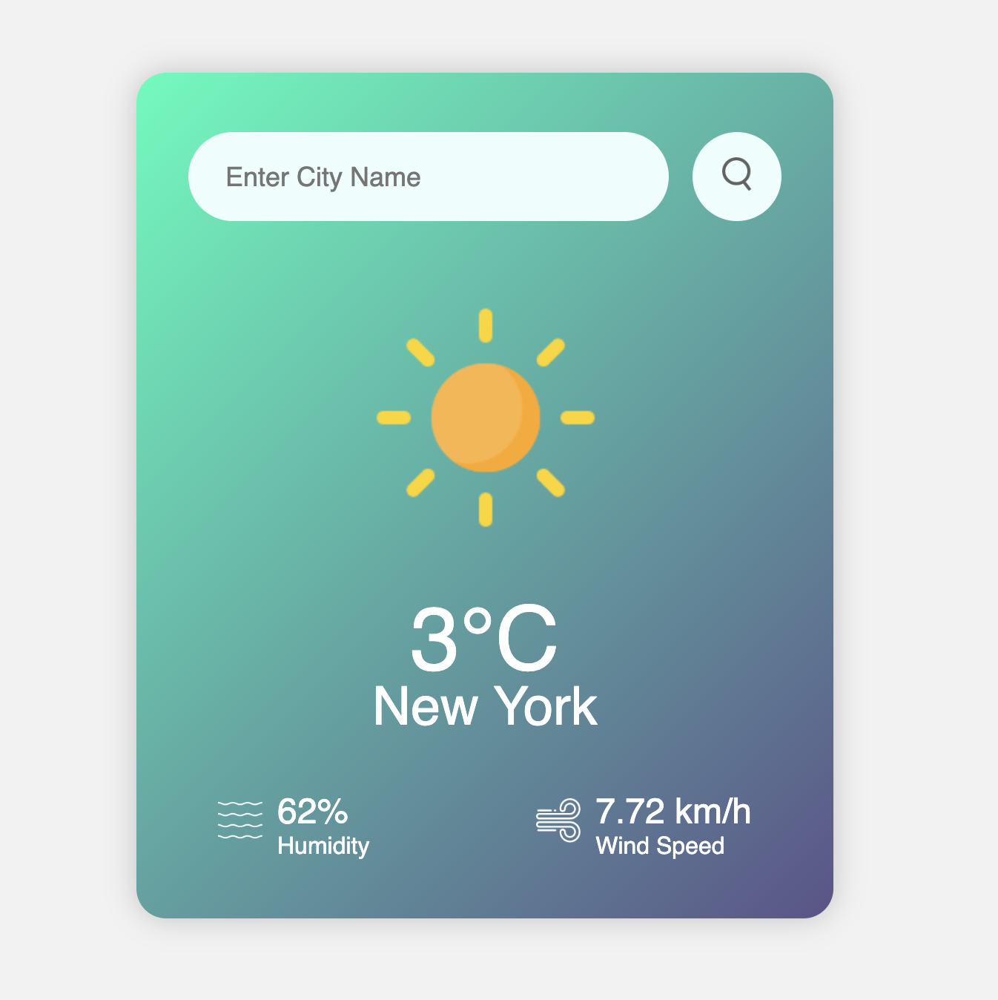
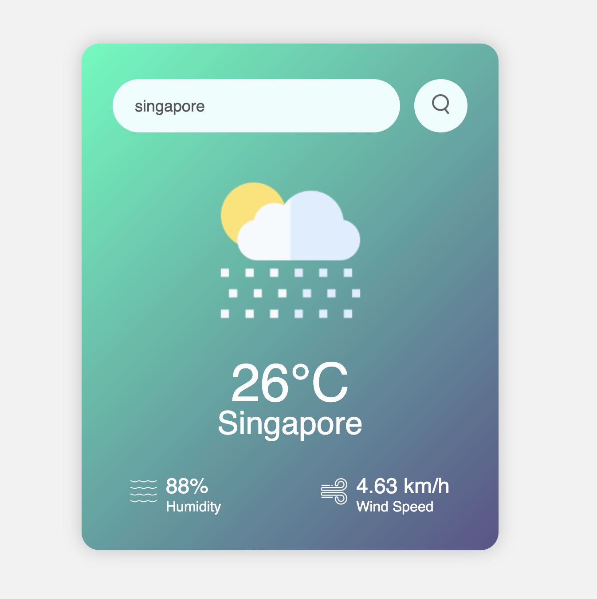

# weather-app

A simple weather app that allows you to check the current weather conditions for a given city.

Live Site Url: [https://kylie-kiaying.github.io/weather-app/](https://kylie-kiaying.github.io/weather-app/)

## Features
- Enter the name of a city to get the current weather information.
- Display temperature, city name, humidity, and wind speed.
- Show weather icons based on the current weather condition.
- Handles errors for invalid city names.

## Screenshot

    
    

## Built With
- HTML, CSS for the user interface.
- JavaScript for fetching and displaying weather data.
- OpenWeatherMap API for weather data.

## Acknowledgements 
GreatStack on YouTube! Do check out his channel
